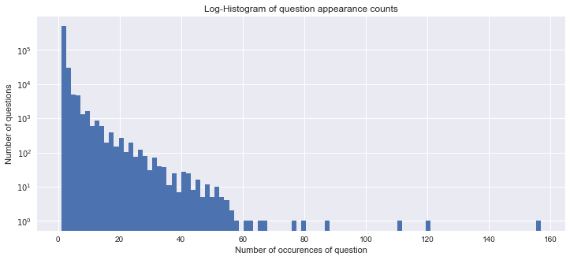
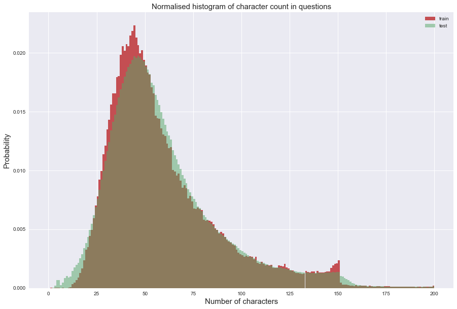
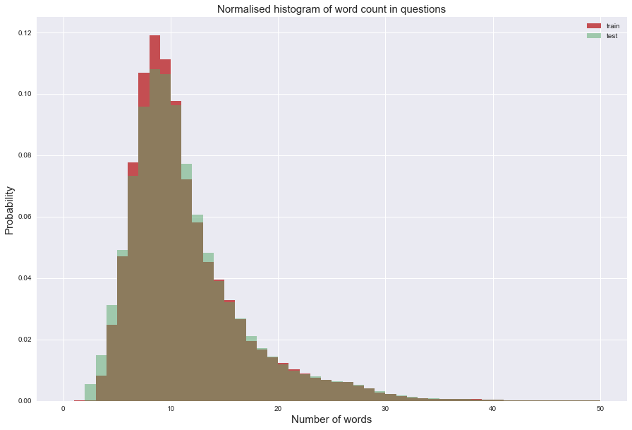
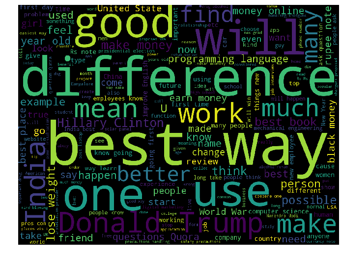
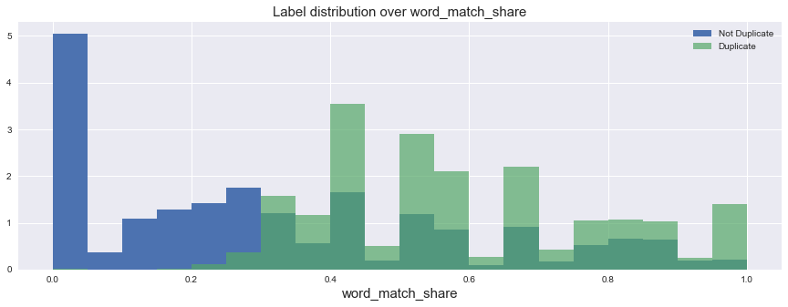
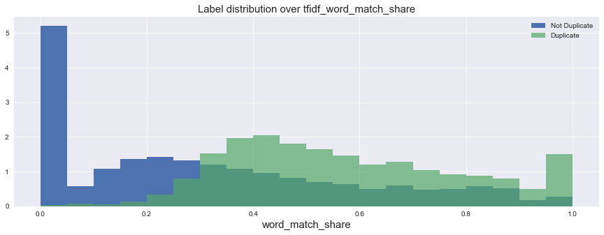

```python
import numpy as np # linear algebra
import pandas as pd # data processing, CSV file I/O (e.g. pd.read_csv)
import os
import gc
import matplotlib.pyplot as plt
import seaborn as sns
%matplotlib inline

pal = sns.color_palette()

print('# File sizes')
for f in os.listdir('/Users/mengxin/Google Drive/DataSci/UsefulLearning/QuoraNLP/'):
    if 'zip' not in f:
        print(f.ljust(30) + str(round(os.path.getsize('/Users/mengxin/Google Drive/DataSci/UsefulLearning/QuoraNLP/' + f) / 1000000, 2)) + 'MB')
```

    # File sizes
    .DS_Store                     0.01MB
    .git                          0.0MB
    .gitignore                    0.0MB
    feature_engineering.py        0.01MB
    GoogleNews-vectors-negative300.bin3644.26MB
    keras_models                  0.0MB
    LSTM.ipynb                    0.03MB
    model1                        0.0MB
    quora_crawler                 0.0MB
    save_objs.p                   12.47MB
    submission0404.csv            66.11MB
    test.csv                      314.02MB
    train.csv                     63.4MB


```python
df_train = pd.read_csv('/Users/mengxin/Google Drive/DataSci/UsefulLearning/QuoraNLP/train.csv')
df_train.head()
```


<div>
<table border="1" class="dataframe">
  <thead>
    <tr style="text-align: right;">
      <th></th>
      <th>id</th>
      <th>qid1</th>
      <th>qid2</th>
      <th>question1</th>
      <th>question2</th>
      <th>is_duplicate</th>
    </tr>
  </thead>
  <tbody>
    <tr>
      <th>0</th>
      <td>0</td>
      <td>1</td>
      <td>2</td>
      <td>What is the step by step guide to invest in sh...</td>
      <td>What is the step by step guide to invest in sh...</td>
      <td>0</td>
    </tr>
    <tr>
      <th>1</th>
      <td>1</td>
      <td>3</td>
      <td>4</td>
      <td>What is the story of Kohinoor (Koh-i-Noor) Dia...</td>
      <td>What would happen if the Indian government sto...</td>
      <td>0</td>
    </tr>
    <tr>
      <th>2</th>
      <td>2</td>
      <td>5</td>
      <td>6</td>
      <td>How can I increase the speed of my internet co...</td>
      <td>How can Internet speed be increased by hacking...</td>
      <td>0</td>
    </tr>
    <tr>
      <th>3</th>
      <td>3</td>
      <td>7</td>
      <td>8</td>
      <td>Why am I mentally very lonely? How can I solve...</td>
      <td>Find the remainder when [math]23^{24}[/math] i...</td>
      <td>0</td>
    </tr>
    <tr>
      <th>4</th>
      <td>4</td>
      <td>9</td>
      <td>10</td>
      <td>Which one dissolve in water quikly sugar, salt...</td>
      <td>Which fish would survive in salt water?</td>
      <td>0</td>
    </tr>
  </tbody>
</table>
</div>


```python
print('Total number of question pairs for training: {}'.format(len(df_train)))
print('Duplicate pairs: {}%'.format(round(df_train['is_duplicate'].mean()*100, 2)))
qids = pd.Series(df_train['qid1'].tolist() + df_train['qid2'].tolist())
print('Total number of questions in the training data: {}'.format(len(
    np.unique(qids))))
print('Number of questions that appear multiple times: {}'.format(np.sum(qids.value_counts() > 1)))

plt.figure(figsize=(12, 5))
plt.hist(qids.value_counts(), bins=100)
plt.yscale('log', nonposy='clip')
plt.title('Log-Histogram of question appearance counts')
plt.xlabel('Number of occurences of question')
plt.ylabel('Number of questions')
print()
```

    Total number of question pairs for training: 404290
    Duplicate pairs: 36.92%
    Total number of questions in the training data: 537933
    Number of questions that appear multiple times: 111780
    





```python
from sklearn.metrics import log_loss

p = df_train['is_duplicate'].mean() # Our predicted probability
print('Predicted score:', log_loss(df_train['is_duplicate'], np.zeros_like(df_train['is_duplicate']) + p))

df_test = pd.read_csv('/Users/mengxin/Google Drive/DataSci/UsefulLearning/QuoraNLP/test.csv')
sub = pd.DataFrame({'test_id': df_test['test_id'], 'is_duplicate': p})
sub.to_csv('naive_submission.csv', index=False)
sub.head()
```

    Predicted score: 0.658527383984


<div>
<table border="1" class="dataframe">
  <thead>
    <tr style="text-align: right;">
      <th></th>
      <th>is_duplicate</th>
      <th>test_id</th>
    </tr>
  </thead>
  <tbody>
    <tr>
      <th>0</th>
      <td>0.369198</td>
      <td>0</td>
    </tr>
    <tr>
      <th>1</th>
      <td>0.369198</td>
      <td>1</td>
    </tr>
    <tr>
      <th>2</th>
      <td>0.369198</td>
      <td>2</td>
    </tr>
    <tr>
      <th>3</th>
      <td>0.369198</td>
      <td>3</td>
    </tr>
    <tr>
      <th>4</th>
      <td>0.369198</td>
      <td>4</td>
    </tr>
  </tbody>
</table>
</div>


```python
df_test = pd.read_csv('/Users/mengxin/Google Drive/DataSci/UsefulLearning/QuoraNLP/test.csv')
df_test.head()
```


<div>
<table border="1" class="dataframe">
  <thead>
    <tr style="text-align: right;">
      <th></th>
      <th>test_id</th>
      <th>question1</th>
      <th>question2</th>
    </tr>
  </thead>
  <tbody>
    <tr>
      <th>0</th>
      <td>0</td>
      <td>How does the Surface Pro himself 4 compare wit...</td>
      <td>Why did Microsoft choose core m3 and not core ...</td>
    </tr>
    <tr>
      <th>1</th>
      <td>1</td>
      <td>Should I have a hair transplant at age 24? How...</td>
      <td>How much cost does hair transplant require?</td>
    </tr>
    <tr>
      <th>2</th>
      <td>2</td>
      <td>What but is the best way to send money from Ch...</td>
      <td>What you send money to China?</td>
    </tr>
    <tr>
      <th>3</th>
      <td>3</td>
      <td>Which food not emulsifiers?</td>
      <td>What foods fibre?</td>
    </tr>
    <tr>
      <th>4</th>
      <td>4</td>
      <td>How "aberystwyth" start reading?</td>
      <td>How their can I start reading?</td>
    </tr>
  </tbody>
</table>
</div>


```python
print('Total number of question pairs for testing: {}'.format(len(df_test)))
```

    Total number of question pairs for testing: 2345796


```python
train_qs = pd.Series(df_train['question1'].tolist() + df_train['question2'].tolist()).astype(str)
test_qs = pd.Series(df_test['question1'].tolist() + df_test['question2'].tolist()).astype(str)

dist_train = train_qs.apply(len)
dist_test = test_qs.apply(len)
plt.figure(figsize=(15, 10))
plt.hist(dist_train, bins=200, range=[0, 200], color=pal[2], normed=True, label='train')
plt.hist(dist_test, bins=200, range=[0, 200], color=pal[1], normed=True, alpha=0.5, label='test')
plt.title('Normalised histogram of character count in questions', fontsize=15)
plt.legend()
plt.xlabel('Number of characters', fontsize=15)
plt.ylabel('Probability', fontsize=15)

print('mean-train {:.2f} std-train {:.2f} mean-test {:.2f} std-test {:.2f} max-train {:.2f} max-test {:.2f}'.format(dist_train.mean(), 
                          dist_train.std(), dist_test.mean(), dist_test.std(), dist_train.max(), dist_test.max()))
```

    mean-train 59.82 std-train 31.96 mean-test 60.07 std-test 31.62 max-train 1169.00 max-test 1176.00





```python
dist_train = train_qs.apply(lambda x: len(x.split(' ')))
dist_test = test_qs.apply(lambda x: len(x.split(' ')))

plt.figure(figsize=(15, 10))
plt.hist(dist_train, bins=50, range=[0, 50], color=pal[2], normed=True, label='train')
plt.hist(dist_test, bins=50, range=[0, 50], color=pal[1], normed=True, alpha=0.5, label='test')
plt.title('Normalised histogram of word count in questions', fontsize=15)
plt.legend()
plt.xlabel('Number of words', fontsize=15)
plt.ylabel('Probability', fontsize=15)

print('mean-train {:.2f} std-train {:.2f} mean-test {:.2f} std-test {:.2f} max-train {:.2f} max-test {:.2f}'.format(dist_train.mean(), 
                          dist_train.std(), dist_test.mean(), dist_test.std(), dist_train.max(), dist_test.max()))
```

    mean-train 11.06 std-train 5.89 mean-test 11.02 std-test 5.84 max-train 237.00 max-test 238.00





```python
from wordcloud import WordCloud
cloud = WordCloud(width=1440, height=1080).generate(" ".join(train_qs.astype(str)))
```


```python
plt.figure(figsize=(12, 9))
plt.imshow(cloud)
plt.axis('off')
```


    (-0.5, 1439.5, 1079.5, -0.5)





Semantic Analysis


```python
qmarks = np.mean(train_qs.apply(lambda x: '?' in x))
math = np.mean(train_qs.apply(lambda x: '[math]' in x))
fullstop = np.mean(train_qs.apply(lambda x: '.' in x))
capital_first = np.mean(train_qs.apply(lambda x: x[0].isupper()))
capitals = np.mean(train_qs.apply(lambda x: max([y.isupper() for y in x])))
numbers = np.mean(train_qs.apply(lambda x: max([y.isdigit() for y in x])))

print('Questions with question marks: {:.2f}%'.format(qmarks * 100))
print('Questions with [math] tags: {:.2f}%'.format(math * 100))
print('Questions with full stops: {:.2f}%'.format(fullstop * 100))
print('Questions with capitalised first letters: {:.2f}%'.format(capital_first * 100))
print('Questions with capital letters: {:.2f}%'.format(capitals * 100))
print('Questions with numbers: {:.2f}%'.format(numbers * 100))
```

    Questions with question marks: 99.87%
    Questions with [math] tags: 0.12%
    Questions with full stops: 6.31%
    Questions with capitalised first letters: 99.81%
    Questions with capital letters: 99.95%
    Questions with numbers: 11.83%


Initial Feature Analysis


```python
import nltk
nltk.download()
from nltk.corpus import stopwords

stops = set(stopwords.words('english'))
```

    showing info https://raw.githubusercontent.com/nltk/nltk_data/gh-pages/index.xml


```python
def word_match_share(row):
    q1words = {}
    q2words = {}
    for word in str(row['question1']).lower().split():
        if word not in stops:
            q1words[word] = 1
    for word in str(row['question2']).lower().split():
        if word not in stops:
            q2words[word] = 1
    if len(q1words) == 0 or len(q2words) == 0:
        # The computer-generated chaff includes a few questions that are nothing but stopwords
        return 0
    shared_words_in_q1 = [w for w in q1words.keys() if w in q2words]
    shared_words_in_q2 = [w for w in q2words.keys() if w in q1words]
    R = (len(shared_words_in_q1) + len(shared_words_in_q2))/(len(q1words) + len(q2words))
    return R

plt.figure(figsize=(15, 5))
train_word_match = df_train.apply(word_match_share, axis=1, raw=True)
plt.hist(train_word_match[df_train['is_duplicate'] == 0], bins=20, normed=True, label='Not Duplicate')
plt.hist(train_word_match[df_train['is_duplicate'] == 1], bins=20, normed=True, alpha=0.7, label='Duplicate')
plt.legend()
plt.title('Label distribution over word_match_share', fontsize=15)
plt.xlabel('word_match_share', fontsize=15)
```


    <matplotlib.text.Text at 0x13e9fc860>





TF-IDF


```python
from collections import Counter

# If a word appears only once, we ignore it completely (likely a typo)
# Epsilon defines a smoothing constant, which makes the effect of extremely rare words smaller
def get_weight(count, eps=10000, min_count=2):
    if count < min_count:
        return 0
    else:
        return 1 / (count + eps)

eps = 5000 
words = (" ".join(train_qs)).lower().split()
counts = Counter(words)
weights = {word: get_weight(count) for word, count in counts.items()}
```


```python
print('Most common words and weights: \n')
print(sorted(weights.items(), key=lambda x: x[1] if x[1] > 0 else 9999)[:10])
print('\nLeast common words and weights: ')
(sorted(weights.items(), key=lambda x: x[1], reverse=True)[:10])
```

    Most common words and weights: 
    
    [('the', 2.5891040146646852e-06), ('what', 3.115623919267953e-06), ('is', 3.5861702928825277e-06), ('how', 4.366449945201053e-06), ('i', 4.4805878531263305e-06), ('a', 4.540645588989843e-06), ('to', 4.671434644293609e-06), ('in', 4.884625153865692e-06), ('of', 5.920242493132519e-06), ('do', 6.070908207867897e-06)]
    
    Least common words and weights: 


    [('シ', 9.998000399920016e-05),
     ('し?', 9.998000399920016e-05),
     ('19-year-old.', 9.998000399920016e-05),
     ('1-855-425-3768', 9.998000399920016e-05),
     ('confederates', 9.998000399920016e-05),
     ('asahi', 9.998000399920016e-05),
     ('fab', 9.998000399920016e-05),
     ('109?', 9.998000399920016e-05),
     ('samrudi', 9.998000399920016e-05),
     ('fulfill?', 9.998000399920016e-05)]


```python
def tfidf_word_match_share(row):
    q1words = {}
    q2words = {}
    for word in str(row['question1']).lower().split():
        if word not in stops:
            q1words[word] = 1
    for word in str(row['question2']).lower().split():
        if word not in stops:
            q2words[word] = 1
    if len(q1words) == 0 or len(q2words) == 0:
        # The computer-generated chaff includes a few questions that are nothing but stopwords
        return 0
    
    shared_weights = [weights.get(w, 0) for w in q1words.keys() if w in q2words] + [weights.get(w, 0) for w in q2words.keys() if w in q1words]
    total_weights = [weights.get(w, 0) for w in q1words] + [weights.get(w, 0) for w in q2words]
    
    R = np.sum(shared_weights) / np.sum(total_weights)
    return R
```


```python
plt.figure(figsize=(15, 5))
tfidf_train_word_match = df_train.apply(tfidf_word_match_share, axis=1, raw=True)
plt.hist(tfidf_train_word_match[df_train['is_duplicate'] == 0].fillna(0), bins=20, normed=True, label='Not Duplicate')
plt.hist(tfidf_train_word_match[df_train['is_duplicate'] == 1].fillna(0), bins=20, normed=True, alpha=0.7, label='Duplicate')
plt.legend()
plt.title('Label distribution over tfidf_word_match_share', fontsize=15)
plt.xlabel('word_match_share', fontsize=15)
```

    /Users/mengxin/anaconda/lib/python3.6/site-packages/ipykernel/__main__.py:17: RuntimeWarning: invalid value encountered in double_scalars


    <matplotlib.text.Text at 0x152824780>





```python
from sklearn.metrics import roc_auc_score
print('Original AUC:', roc_auc_score(df_train['is_duplicate'], train_word_match))
print('   TFIDF AUC:', roc_auc_score(df_train['is_duplicate'], tfidf_train_word_match.fillna(0)))
```

    Original AUC: 0.780553200628
       TFIDF AUC: 0.77056466105


Rebalancing Data


```python
# First we create our training and testing data
x_train = pd.DataFrame()
x_test = pd.DataFrame()
x_train['word_match'] = train_word_match
x_train['tfidf_word_match'] = tfidf_train_word_match
x_test['word_match'] = df_test.apply(word_match_share, axis=1, raw=True)
x_test['tfidf_word_match'] = df_test.apply(tfidf_word_match_share, axis=1, raw=True)

y_train = df_train['is_duplicate'].values
```


    ---------------------------------------------------------------------------

    NameError                                 Traceback (most recent call last)

    <ipython-input-8-e63caec5df15> in <module>()
          2 x_train = pd.DataFrame()
          3 x_test = pd.DataFrame()
    ----> 4 x_train['word_match'] = train_word_match
          5 x_train['tfidf_word_match'] = tfidf_train_word_match
          6 x_test['word_match'] = df_test.apply(word_match_share, axis=1, raw=True)


    NameError: name 'train_word_match' is not defined


```python
pos_train = x_train[y_train == 1]
neg_train = x_train[y_train == 0]

# Now we oversample the negative class
# There is likely a much more elegant way to do this...
p = 0.165
scale = ((len(pos_train) / (len(pos_train) + len(neg_train))) / p) - 1
while scale > 1:
    neg_train = pd.concat([neg_train, neg_train])
    scale -=1
neg_train = pd.concat([neg_train, neg_train[:int(scale * len(neg_train))]])
print(len(pos_train) / (len(pos_train) + len(neg_train)))

x_train = pd.concat([pos_train, neg_train])
y_train = (np.zeros(len(pos_train)) + 1).tolist() + np.zeros(len(neg_train)).tolist()
del pos_train, neg_train
```

    0.19124366100096607


```python
# Finally, we split some of the data off for validation
from sklearn.cross_validation import train_test_split

x_train, x_valid, y_train, y_valid = train_test_split(x_train, y_train, test_size=0.2, random_state=4242)
```

xgboost


```python
import xgboost as xgb

# Set our parameters for xgboost
params = {}
params['objective'] = 'binary:logistic'
params['eval_metric'] = 'logloss'
params['eta'] = 0.02
params['max_depth'] = 4
```


```python
d_train = xgb.DMatrix(x_train, label=y_train)
d_valid = xgb.DMatrix(x_valid, label=y_valid)

watchlist = [(d_train, 'train'), (d_valid, 'valid')]

bst = xgb.train(params, d_train, 400, watchlist, early_stopping_rounds=50, verbose_eval=10)
```


    ---------------------------------------------------------------------------

    NameError                                 Traceback (most recent call last)

    <ipython-input-9-778192c5c9c7> in <module>()
    ----> 1 d_train = xgb.DMatrix(x_train, label=y_train)
          2 d_valid = xgb.DMatrix(x_valid, label=y_valid)
          3 
          4 watchlist = [(d_train, 'train'), (d_valid, 'valid')]
          5 


    NameError: name 'y_train' is not defined


```python

```
